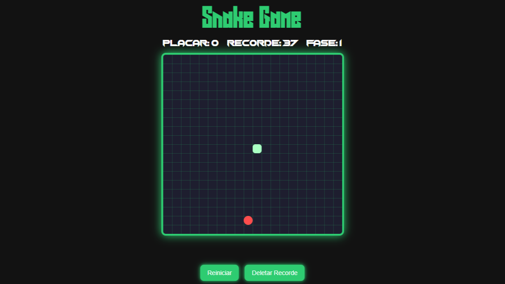

<h1 align="center"> Jônatas Batista | Snake Game </h1>

  <a href="#-tecnologias">Tecnologias</a>&nbsp;&nbsp;&nbsp;|&nbsp;&nbsp;&nbsp;
  <a href="#-projeto">Projeto</a>&nbsp;&nbsp;&nbsp;|&nbsp;&nbsp;&nbsp;
  <a href="#memo-licença">Licença</a>

  

 

  

## 🚀 Tecnologias

Esse projeto foi desenvolvido com as seguintes tecnologias:

- HTML e CSS
- JavaScript

## 💻 Projeto

Jogo da cobrinha clássico, implementado com HTML, CSS e JavaScript. Controle simples, responsivo, com sistema de colisão e pontuação dinâmica. Perfeito para treinar lógica de programação e manipulação do DOM.

- [Acesse o projeto](https://jonatas-b.github.io/Snake-Game/)

## :memo: Licença

Esse projeto está sob a licença MIT.

---

© 2025 Jônatas Emanuel Batista
